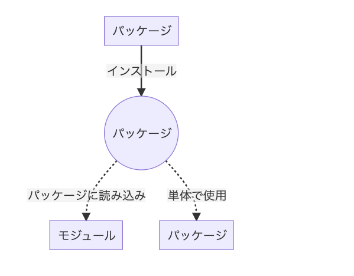

# npm

## 基礎知識

パッケージのインストールには特定のプロジェクトに個別にインストールするローカルインストールと、使用している PC にインストールするグローバルインストールがある。どのプロジェクトでも使う汎用的なパッケージはグローバルインストールすべし。（npm とか）

特定のプロジェクト配下の package.json に使用したいパッケージを置いて npm install することでローカルにインストールされる。このとき node_modules というフォルダができて、その中にインストールされていることになる。ちなみにこのとき最新のバーションがインストールされる。
特定のバージョンをインストールしたい場合は package.lock.json というファイルを使用することになる。

1〜2 個のパッケージをインストールしたとしてもその他多くのパッケージがインストールされている。これはその依存関係にあるパッケージもインストールされているからである。パッケージは独自の package.json を持ち、パッケージを管理しあっている。

## ローカルインストールの罠

パッケージが動作しないときはローカルインストールを行ったため、PATH が通っていないのが原因。

ローカルインストールは自動で PATH を通してくれない。つまり、直接 PATH を指定しなければいけない。これらパッケージの実行ファイルは、各パッケージの.bin ディレクトリにあるのでそれを指定する。

### 例えば、webpack の例をいかに記載

- ./node_modules/webpack/bin/webpack.js のように設定

  実行のたびにこれは面倒。実は node_modules ディレクトリに.bin がいるので以下

- ./node_modules/.bin/webpack

  これで PATH の最後だけパッケージごとに変えれば良くなった、が、それでも面倒。そのため以下

- package.json の scripts フィールドに設定して、npm run で実行する

  ```yaml
  "scripts": {
  "webpack": "./node_modules/.bin/webpack"
  },
  ```

  とても良さげな解決策だが、その都度 scripts フィールドに設定するのは面倒

- 環境変数にこの/node_modules/.bin/を追加
  webpack コマンドで実行でき、別のパッケージをインストールした際も、そのコマンドだけで実行できる。ただし、プロジェクトの度に環境変数を設定することになり、OS の環境変数を汚してしまう

そこで npx というものが誕生した

### npx

./node_modules/.bin からコマンドを探して実行する。それだけでなく、そのコマンドがインストールされていなくても、それを専用の場所へ一時的にダウンロードをして実行し、処理が完了したら削除してくれる。

## package.json

package.json とはプロジェクトの構成、構造を示した設計書のようなもの

名前に違和感があるかもしれないがプロジェクトはパッケージでもある（衝撃）

↓ 一例

```json
{
  "name": "motorcycles",
  "version": "1.0.0",
  "description": "Returns the name of your favorite motorcycle.",
  "main": "index.js",
  "scripts": {
    "choose": "node index.js"
  },
  "author": "ANTEZ(https://zenn.dev/antez)",
  "license": "MIT",
  "devDependencies": {
    "webpack": "^5.68.0",
    "webpack-cli": "^4.9.2"
  },
  "dependencies": {
    "readline-sync": "^1.4.10"
  }
}
```

### version

パッケージのバージョンを設定。大抵がセマンティックバージョニング(Semver:Semantic Versioning) という規則に則って設定される。これは 3.12.1 という風に、3 つの数字をカンマ区切りで表現する。

- メジャーナンバー
  一番左の番号はメジャーナンバーです。大きな変更、いわゆるメジャーアップデートがあれば数字が上がります。前のバージョンと互換生がない API の変更の時に増加
- マイナーナンバー
  真ん中の番号はマイナーナンバーです。新しい機能が追加されると数字が上がります。前のバージョンと互換性がありつつ機能の変更、追加の時に増加
- パッチナンバー
  一番右の番号はパッチナンバーです。バグが修正されると数字が上がります。
  つまり、最初は 1.0.0 などになります。

### チルダ表記 ( ~ )

MINOR が明記されているなら PATCH の更新を許容、そうではない場合は MINOR の変更を許容

- ~1.2.3 : MINOR が明記されてるから PATCH の更新許容(1.2.3 以上 1.3.0 未満)
- ~1 : MINOR が明記されてないから MINOR の更新許容(1.0.0 以上 2.0.0 未満)

### キャレット表記 ( ^ )

一番左側にある、ゼロでないバージョニングは変えない (それ以下があがることは許容)

- ^1.2.3：一番左側にある、ゼロでない要素が MAJOR だから MINOR、PATCH の更新可能(1.2.3 以上 2.0.0 未満)
- ^0.2.3：一番左側にある、ゼロでない要素は MINOR だから PATCH の更新可能(0.2.3 以上 0.3.0 未満)
- ^0.0.3：一番左側にある、ゼロでない要素は PATCH だからアップデート不可能

### scripts

コマンドのエイリアスを設定する

```json
"scripts": {
  "webpack": "./node_modules/.bin/webpack",
},
```

このような設定があるとすると

```
$ npm run webpack
```

と

```
$ ./node_modules/.bin/webpack
```

は同じことを意味する

### dependencies

そのパッケージを実行するのに必要なパッケージを設定する。

npm install で、package.json に設定されたパッケージをインストールするが、これは dependencies と devDependencies（次に紹介） に設定されたパッケージがインストールされる。

バージョンに`^`（キャレット）や`~`（チルダ）が付いている。これは、`^`が付いていると、メジャーナンバーは一致するがマイナーナンバーとパッチナンバーは設定しているもの以上という意味になり、`~`が付いていると、メジャーナンバーとマイナーナンバーは一致するがパッチナンバーは設定しているもの以上という意味になる。

なぜこのように面倒な設定を行うのか。開発現場ではよくあるが、関連するシステムのバージョンを上げると、システムが正常に機能しなくなることがある。例えばメジャーアップデートなどで、処理の内容を変更されているなどがあるからだ。そこで、比較的安心できるマイナーナンバーからインストールしたり、バグが修正のみのパッチナンバーからインストールしたりする。

### devDependencies

devDependencies には、そのパッケージを実行するのには関係なく、開発やテスト時に使用するパッケージを設定する

- `npm install ***`とした場合、devDependencies に設定されたパッケージはインストールされない。
- 手元の package.json から `npm install` する場合は、dependencies と devDependencies に設定された両方のパッケージがインストールされる。
- `npm install --production` とオプションを付けると、devDependencies に設定されたパッケージはインストールされなくなる。

## package-lock.json

package-lock.json は、パッケージのバージョンをロックするファイル。パッケージを npm install でインストールすると作成され、その後 npm install でインストールする度に更新される。

ある開発プロジェクトにおいて複数人で開発を進める場合、全員の開発環境を揃えるためパッケージのバージョンも全て同じにする必要があるときに使う。

package-lock.json でインストールするには、npm install ではなく次のコマンドを使用。

```
$ npm ci
```

npm ci でインストールすると、設定されているバージョンのパッケージをインストールするので、当然 package-lock.json は更新されない。また、node_modules 内のパッケージをすべて削除してからインストールするという徹底ぶり。

裏を返すと、npm ci というコマンドを実行しなければ package-lock.json は使用されない。

lock ファイルをプロジェクトの git リポジトリにプッシュしておいたら、他のエンジニアもそれを共有してもらえます。こうしてチームメンバー同士に同じバージョンのパッケージが持てるようになる

package.json との比較

- package.json

  - インストールすべきパッケージのバージョンの範囲
  - その他もろもろ（npm-scripts など）

- package-lock.json

  - npm install によって実際にインストールしたパッケージのバージョンのみ

### まとめ

- package-lock.json は npm install 実行時に新規作成・更新される
- package-lock.json には npm install で実際にインストールしたパッケージ情報が記載されている
- package-lock.json を使用してパッケージをインストールする際には npm ci コマンドを実行する
- npm ci コマンドを実行する主なユースケースとしては CI 実行時や git clone 後の動作確認などで使用する
- 上記の用途があるので package-lock.json は Git で管理したほうがいいファイルである
- npm ci は npm install と同じように全ての依存パッケージをインストールする
- npm install コマンド実行によって package-lock.json を更新することがある
- npm ci コマンド実行によって package-lock.json は更新されない
- npm ci コマンド実行すると node_modules をすべて削除してからパッケージをインストールする

### yarn.lock

package-lock.json と yarn.lock は、プロジェクトが依存してるパッケージの正確なバージョンを記録してるファイル。

npm なら package-lock.json、yarn なら yarn.lock になるだけでやってることは同じ

## パッケージとモジュール

npm でのモジュールとは、node_modules ディレクトリに存在し、require() 関数で読み込んで使用されるもの

npm でのパッケージとは、package.json で管理しているプロジェクトのこと

- 最初は全てパッケージです。
- パッケージを他のパッケージインストールして、その使われ方によってパッケージとモジュールに分かれます。
- 単体で使用するならパッケージ。読み込まれて使用されるならモジュール。

|
|:-:|

node_modules の中にある、読み込まれてることによって機能するファイルは、全てモジュール

## npm install

npm install 実行時は以下のような挙動をしています。

1. package.json の内容を更新する
2. package.json の内容をもとに node_modules のディレクトリにパッケージをインストールする
3. node_modules に実際にインストールされたパッケージのバージョン情報が package-lock.json に記述される

## 参考

- [そもそも npm からわからない](https://zenn.dev/antez/articles/a9d9d12178b7b2)
- [package-lock.json と yarn.lock の存在理由](https://zenn.dev/luvmini511/articles/56bf98f0d398a5)
- [package-lock.json ってなに？](https://qiita.com/sugurutakahashi12345/items/1f6bb7a372b8263500e5)
